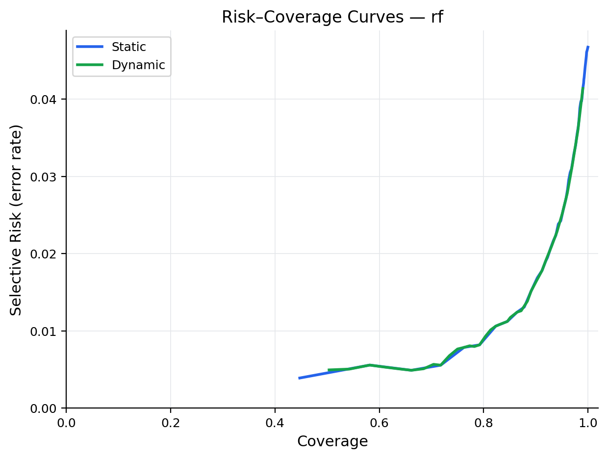
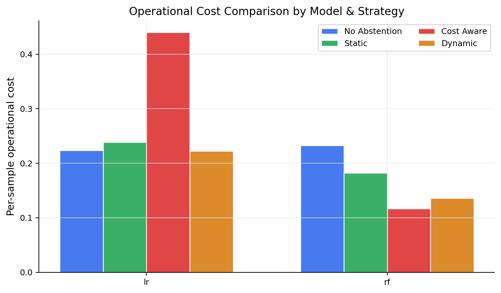
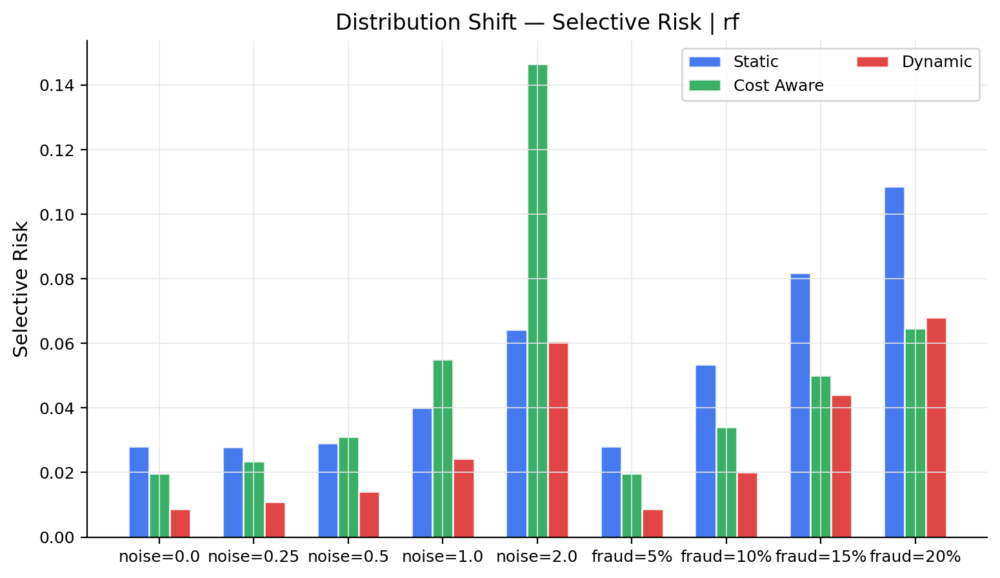

# Selective Prediction under Uncertainty  
### *When Should a Machine Learning Model Refuse to Predict?*

An undergraduate machine learning research project exploring **selective prediction**, **risk-aware automation**, and **uncertainty-aware decision making** in high-stakes environments.

---

## Project Overview

Most machine learning systems are designed to produce a prediction for **every input**, even when confidence is low. In safety-critical domains such as **fraud detection, healthcare, and financial risk assessment**, uncertain predictions can lead to costly consequences.

This project investigates **selective prediction**, where a model is allowed to:

- **Predict** when confidence is sufficiently high  
- **Abstain** when uncertainty is extreme  
- **Defer** uncertain cases for additional review or evidence collection  

Instead of optimizing for accuracy alone, the system is evaluated through a **risk-aware decision framework** that balances:

- Prediction reliability  
- Operational cost  
- Automation coverage  
- Robustness under uncertainty  

---

## Research Motivation

Traditional classifiers assume:

> *Every input must receive an immediate prediction.*

However, real-world systems often support **human review** or **delayed decision making**.

For example:

- A fraud detection system may flag suspicious transactions for manual verification
- A loan approval system may request additional documentation
- A monitoring system may delay escalation until further signals arrive

This project explores:

> **When should a machine learning model refuse to predict?**

---

## Research Questions

This work investigates the following questions:

1. **When should a model abstain from prediction?**  
   What confidence criteria minimize operational cost without sacrificing excessive automation?

2. **Do abstention strategies matter?**  
   How do static thresholds, cost-aware policies, and dynamic thresholding compare?

3. **How robust are uncertainty-aware policies under distribution shift?**  
   What happens when deployment data differs from training conditions?

4. **Can a tri-action framework improve reliability?**  
   Does introducing a **Predict / Defer / Abstain** decision mechanism reduce high-cost errors?

---

## Example Outputs

### Risk–Coverage Trade-off
Shows how prediction risk changes as automated coverage varies.



---

### Cost Comparison Across Decision Policies
Comparison of operational cost across multiple uncertainty-aware strategies.



---

### Distribution Shift Robustness
Evaluates selective risk under changing data distributions.



---

## Methodology

### Decision Strategies

| Strategy | Description |
|----------|-------------|
| **Static Threshold** | Abstain if confidence falls below a fixed threshold |
| **Cost-Aware** | Compare expected prediction cost vs abstention cost |
| **Dynamic Threshold** | Adapt confidence thresholds to maintain target coverage |
| **Tri-Action Framework** | Predict / Defer / Abstain decision policy |

---

### Cost Model

The framework explicitly models asymmetric operational cost:

```python
False Positive Cost = 1.0
False Negative Cost = 5.0
Abstention Cost     = 0.5
Deferral Cost       = 1.5
```

The cost structure reflects realistic deployment assumptions where **missing fraud is substantially more expensive than false alarms**.

---

## Dataset

Experiments are conducted using the **Credit Card Fraud Detection dataset**, a highly imbalanced real-world classification benchmark suitable for uncertainty-aware prediction.

If the dataset is unavailable, the project automatically generates a **synthetic fraud detection dataset** for reproducibility.

Dataset location:

```text
data/raw/creditcard.csv
```

---

## Project Structure

```text
selective_prediction_uncertainty/
│
├── README.md
├── requirements.txt
├── run_experiments.py
│
├── data/
│   ├── raw/
│   └── processed/
│
├── notebooks/
│   ├── 01_data_analysis.ipynb
│   ├── 02_selective_prediction.ipynb
│   └── 03_distribution_shift.ipynb
│
├── src/
│   ├── preprocessing.py
│   ├── training.py
│   ├── selective_prediction.py
│   ├── calibration.py
│   ├── evaluation.py
│   ├── risk_metrics.py
│   ├── visualization.py
│   └── utils.py
│
├── experiments/
│   ├── configs/
│   ├── outputs/
│   └── saved_models/
│
├── reports/
│   ├── figures/
│   ├── results_tables/
│   └── insights/
│
└── demo/
    └── demo_prediction.py
```

---

## Installation

### 1. Create Virtual Environment

### macOS / Linux

```bash
python3 -m venv venv
source venv/bin/activate
```

### Windows

```bash
python -m venv venv
venv\Scripts\activate
```

---

### 2. Install Dependencies

```bash
pip install -r requirements.txt
```

---

## Running the Project

### Run Full Experiment Pipeline

```bash
python run_experiments.py
```

This will:

- Train models
- Apply selective prediction strategies
- Evaluate uncertainty-aware policies
- Generate plots and result tables
- Simulate distribution shift

Generated outputs are saved to:

```text
reports/figures/
experiments/outputs/
```

---

### Run Interactive Demo

```bash
python demo/demo_prediction.py
```

This demonstrates the **Predict / Defer / Abstain** framework on sample predictions.

---

### Run Jupyter Notebooks

```bash
jupyter notebook
```

Run notebooks in order:

1. `01_data_analysis.ipynb`
2. `02_selective_prediction.ipynb`
3. `03_distribution_shift.ipynb`

---

## Key Findings

Experimental results indicate:

- Selective prediction reduces unreliable predictions under uncertainty
- Cost-aware policies achieve lower operational risk
- Tri-action decision policies preserve higher automation coverage
- Distribution shift significantly impacts confidence reliability
- Delay-aware decisions can reduce high-cost mistakes

---

## Future Improvements

Potential extensions include:

- Conformal prediction for formal uncertainty guarantees
- Adaptive threshold learning
- Online selective prediction under streaming data
- Human-in-the-loop evaluation systems

---

## Reproducibility

All experiments are reproducible through:

```bash
python run_experiments.py
```

Random seeds are fixed for consistency across runs.

---

## Author

**Rajveer Singh Arneja**  
NMIMS University

---

## License

MIT License
